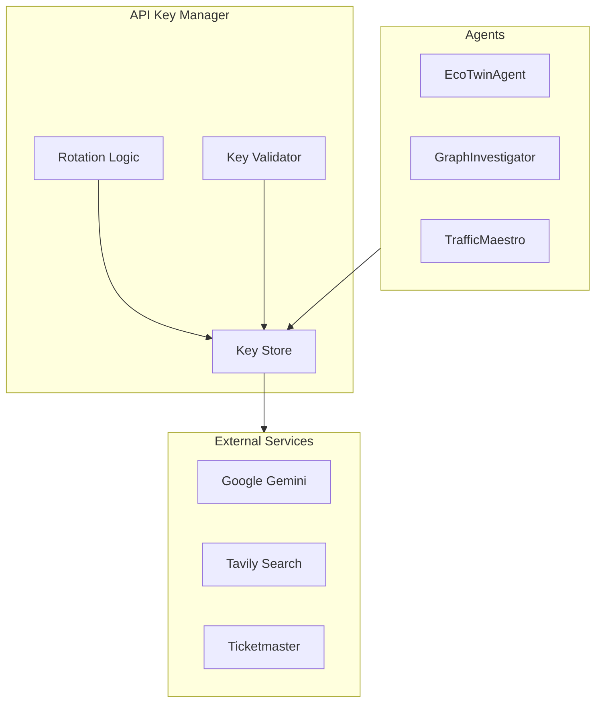
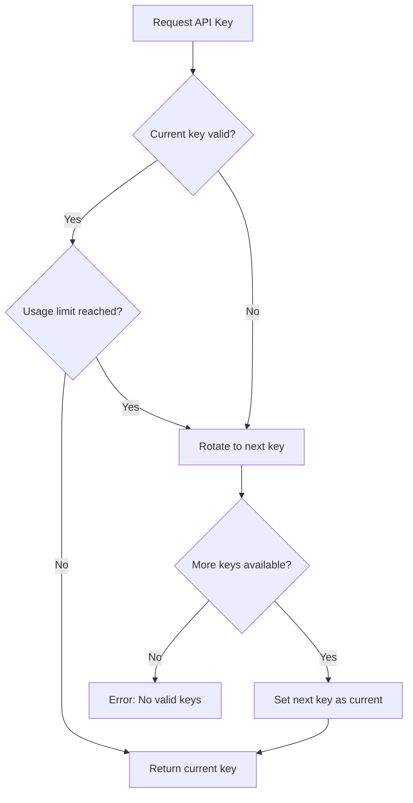

<!--
============================================================================
UIP - Urban Intelligence Platform
Copyright (c) 2025 UIP Team. All rights reserved.
https://github.com/UIP-Urban-Intelligence-Platform/UIP-Urban_Intelligence_Platform

SPDX-License-Identifier: MIT
============================================================================
File: backend/utils/apiKeyRotation.md
Module: Backend Utils - API Key Rotation
Author: Nguyen Nhat Quang (Lead), Nguyen Viet Hoang, Nguyen Dinh Anh Tuan
Created: 2025-11-20
Version: 1.0.0
License: MIT

Description:
  API Key Rotation utility documentation for secure management of
  external service credentials with automatic rotation.
============================================================================
-->

# API Key Rotation

Secure **API key rotation** utility for managing external service credentials with automatic rotation schedules and secure storage.

## Overview



## Features

| Feature | Description |
|---------|-------------|
| **Key Rotation** | Scheduled key rotation (weekly/monthly) |
| **Multi-Key Support** | Pool of keys for load distribution |
| **Validation** | Test key validity before use |
| **Fallback** | Automatic fallback to backup keys |
| **Rate Limiting** | Track usage per key |
| **Audit Logging** | Log all key operations |

## Class Definition

```typescript
interface ApiKey {
  id: string;
  value: string;
  service: string;
  createdAt: Date;
  expiresAt: Date;
  usageCount: number;
  lastUsed: Date;
  isActive: boolean;
}

export class ApiKeyRotation {
  private keys: Map<string, ApiKey[]>;
  private currentIndex: Map<string, number>;
  
  // Key Management
  getKey(service: string): string;
  rotateKey(service: string): void;
  addKey(service: string, key: string): void;
  removeKey(service: string, keyId: string): void;
  
  // Validation
  validateKey(service: string, key: string): Promise<boolean>;
  
  // Monitoring
  getUsageStats(service: string): KeyUsageStats;
  checkExpiration(): ExpiredKey[];
}
```

## Configuration

```typescript
// config/apiKeys.ts
export const keyConfig = {
  gemini: {
    rotationInterval: 7 * 24 * 60 * 60 * 1000, // 7 days
    maxUsagePerKey: 10000,
    keys: process.env.GEMINI_API_KEYS?.split(',') || []
  },
  tavily: {
    rotationInterval: 30 * 24 * 60 * 60 * 1000, // 30 days
    maxUsagePerKey: 5000,
    keys: process.env.TAVILY_API_KEYS?.split(',') || []
  }
};
```

## Usage Examples

### Get Current API Key

```typescript
import { apiKeyRotation } from '../utils/apiKeyRotation';

// Get active key for Gemini
const geminiKey = apiKeyRotation.getKey('gemini');

// Use in agent
const genAI = new GoogleGenerativeAI(geminiKey);
```

### Manual Key Rotation

```typescript
// Force rotation (e.g., after rate limit hit)
apiKeyRotation.rotateKey('gemini');

// Get new key
const newKey = apiKeyRotation.getKey('gemini');
```

### Add New Key

```typescript
// Add key dynamically
apiKeyRotation.addKey('gemini', 'AIza...');

// Validate before adding
const isValid = await apiKeyRotation.validateKey('gemini', 'AIza...');
if (isValid) {
  apiKeyRotation.addKey('gemini', 'AIza...');
}
```

### Check Expiration

```typescript
// Check for expiring keys
const expiringKeys = apiKeyRotation.checkExpiration();

expiringKeys.forEach(key => {
  logger.warn(`Key expiring soon: ${key.service}/${key.id}`);
  // Send notification
});
```

## Rotation Strategy



## Environment Variables

```bash
# .env
# Multiple keys separated by comma
GEMINI_API_KEYS=AIza...,AIza...,AIza...
TAVILY_API_KEYS=tvly...,tvly...
TICKETMASTER_API_KEY=abc123

# Rotation settings
API_KEY_ROTATION_ENABLED=true
API_KEY_ROTATION_INTERVAL=604800000  # 7 days in ms
```

## Key Validation

```typescript
async validateKey(service: string, key: string): Promise<boolean> {
  switch (service) {
    case 'gemini':
      try {
        const genAI = new GoogleGenerativeAI(key);
        const model = genAI.getGenerativeModel({ model: 'gemini-pro' });
        await model.generateContent('test');
        return true;
      } catch {
        return false;
      }
      
    case 'tavily':
      try {
        const response = await fetch('https://api.tavily.com/health', {
          headers: { 'X-API-Key': key }
        });
        return response.ok;
      } catch {
        return false;
      }
      
    default:
      return false;
  }
}
```

## Usage Tracking

```typescript
interface KeyUsageStats {
  service: string;
  totalKeys: number;
  activeKeys: number;
  totalUsage: number;
  usageByKey: Record<string, number>;
  rotationCount: number;
  lastRotation: Date;
}

// Get stats
const stats = apiKeyRotation.getUsageStats('gemini');
console.log(`Total Gemini usage: ${stats.totalUsage}`);
console.log(`Keys rotated: ${stats.rotationCount} times`);
```

## Security Considerations

1. **Never commit keys to git** - Use environment variables
2. **Encrypt at rest** - Store encrypted in production
3. **Audit logging** - Log all key operations
4. **Rate limiting** - Track usage per key
5. **Expiration alerts** - Notify before expiry

## Related Documentation

- [EcoTwinAgent](../agents/EcoTwinAgent.md) - Uses Gemini API
- [GraphInvestigatorAgent](../agents/GraphInvestigatorAgent.md) - Uses Tavily API
- [Logger](./logger.md) - Audit logging

## References

- [OWASP API Security](https://owasp.org/www-project-api-security/)
- [Secret Management Best Practices](https://cloud.google.com/secret-manager/docs/best-practices)
