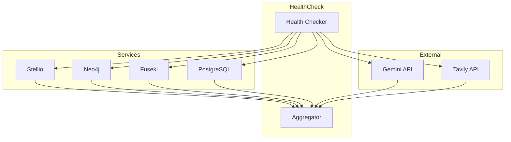

<!--
============================================================================
UIP - Urban Intelligence Platform
Copyright (c) 2025 UIP Team. All rights reserved.
https://github.com/UIP-Urban-Intelligence-Platform/UIP-Urban_Intelligence_Platform

SPDX-License-Identifier: MIT
============================================================================
File: backend/utils/healthCheck.md
Module: Backend Utils - Health Check
Author: Nguyen Nhat Quang (Lead), Nguyen Viet Hoang, Nguyen Dinh Anh Tuan
Created: 2025-11-20
Version: 1.0.0
License: MIT

Description:
  Health Check utility documentation for monitoring service connectivity
  to databases and external APIs.
============================================================================
-->

# Health Check Utility

Health check utility for monitoring **service connectivity** to Stellio, Neo4j, Fuseki, PostgreSQL, and external APIs.

## Overview



## Features

| Feature | Description |
|---------|-------------|
| **Liveness Probe** | Is the server running? |
| **Readiness Probe** | Is the server ready for requests? |
| **Dependency Check** | Individual service status |
| **Timeout Handling** | 5s timeout per check |
| **Aggregate Status** | Overall health determination |

## API Endpoint

### GET /api/health

Returns overall health status and individual service statuses.

**Response (Healthy):**

```json
{
  "status": "healthy",
  "timestamp": "2025-11-29T10:30:00.000Z",
  "uptime": 3600,
  "services": {
    "stellio": {
      "status": "connected",
      "latency": 45,
      "version": "1.5.0"
    },
    "neo4j": {
      "status": "connected",
      "latency": 28
    },
    "fuseki": {
      "status": "connected",
      "latency": 35
    },
    "postgres": {
      "status": "connected",
      "latency": 12
    }
  }
}
```

**Response (Degraded):**

```json
{
  "status": "degraded",
  "timestamp": "2025-11-29T10:30:00.000Z",
  "uptime": 3600,
  "services": {
    "stellio": {
      "status": "connected",
      "latency": 45
    },
    "neo4j": {
      "status": "error",
      "error": "Connection refused",
      "lastSuccess": "2025-11-29T10:25:00.000Z"
    },
    "fuseki": {
      "status": "connected",
      "latency": 35
    },
    "postgres": {
      "status": "connected",
      "latency": 12
    }
  }
}
```

## Implementation

```typescript
// utils/healthCheck.ts
export interface ServiceHealth {
  status: 'connected' | 'error' | 'timeout';
  latency?: number;
  error?: string;
  version?: string;
  lastSuccess?: string;
}

export interface HealthCheckResult {
  status: 'healthy' | 'degraded' | 'unhealthy';
  timestamp: string;
  uptime: number;
  services: Record<string, ServiceHealth>;
}

export async function performHealthCheck(): Promise<HealthCheckResult> {
  const startTime = Date.now();
  
  const [stellio, neo4j, fuseki, postgres] = await Promise.all([
    checkStellioHealth(),
    checkNeo4jHealth(),
    checkFusekiHealth(),
    checkPostgresHealth()
  ]);
  
  const services = { stellio, neo4j, fuseki, postgres };
  const status = determineOverallStatus(services);
  
  return {
    status,
    timestamp: new Date().toISOString(),
    uptime: process.uptime(),
    services
  };
}
```

## Individual Health Checks

### Stellio Health Check

```typescript
async function checkStellioHealth(): Promise<ServiceHealth> {
  const start = Date.now();
  try {
    const response = await axios.get(`${STELLIO_URL}/health`, {
      timeout: 5000
    });
    return {
      status: 'connected',
      latency: Date.now() - start,
      version: response.data.version
    };
  } catch (error) {
    return {
      status: 'error',
      error: error.message
    };
  }
}
```

### Neo4j Health Check

```typescript
async function checkNeo4jHealth(): Promise<ServiceHealth> {
  const start = Date.now();
  try {
    const session = driver.session();
    await session.run('RETURN 1');
    await session.close();
    return {
      status: 'connected',
      latency: Date.now() - start
    };
  } catch (error) {
    return {
      status: 'error',
      error: error.message
    };
  }
}
```

### PostgreSQL Health Check

```typescript
async function checkPostgresHealth(): Promise<ServiceHealth> {
  const start = Date.now();
  try {
    await pool.query('SELECT 1');
    return {
      status: 'connected',
      latency: Date.now() - start
    };
  } catch (error) {
    return {
      status: 'error',
      error: error.message
    };
  }
}
```

## Status Determination

```typescript
function determineOverallStatus(
  services: Record<string, ServiceHealth>
): 'healthy' | 'degraded' | 'unhealthy' {
  const statuses = Object.values(services).map(s => s.status);
  
  // Unhealthy: Stellio (critical service) is down
  if (services.stellio.status !== 'connected') {
    return 'unhealthy';
  }
  
  // Degraded: Any non-critical service is down
  if (statuses.some(s => s !== 'connected')) {
    return 'degraded';
  }
  
  // Healthy: All services connected
  return 'healthy';
}
```

## Kubernetes Probes

```yaml
# k8s-deployment.yaml
livenessProbe:
  httpGet:
    path: /api/health
    port: 5000
  initialDelaySeconds: 30
  periodSeconds: 10

readinessProbe:
  httpGet:
    path: /api/health
    port: 5000
  initialDelaySeconds: 5
  periodSeconds: 5
```

## Docker Health Check

```dockerfile
# Dockerfile
HEALTHCHECK --interval=30s --timeout=10s --start-period=5s --retries=3 \
  CMD curl -f http://localhost:5000/api/health || exit 1
```

## Monitoring Integration

```typescript
// Prometheus metrics
app.get('/metrics', async (req, res) => {
  const health = await performHealthCheck();
  
  const metrics = `
# HELP service_health Service health status
# TYPE service_health gauge
service_health{service="stellio"} ${health.services.stellio.status === 'connected' ? 1 : 0}
service_health{service="neo4j"} ${health.services.neo4j.status === 'connected' ? 1 : 0}
service_health{service="fuseki"} ${health.services.fuseki.status === 'connected' ? 1 : 0}
service_health{service="postgres"} ${health.services.postgres.status === 'connected' ? 1 : 0}

# HELP service_latency_ms Service response latency in milliseconds
# TYPE service_latency_ms gauge
service_latency_ms{service="stellio"} ${health.services.stellio.latency || 0}
service_latency_ms{service="neo4j"} ${health.services.neo4j.latency || 0}
  `;
  
  res.type('text/plain').send(metrics);
});
```

## Related Documentation

- [Backend Overview](../overview.md) - Server architecture
- [Services](../services/stellioService.md) - Service layer
- [Logger](./logger.md) - Health logging

## References

- [Kubernetes Health Probes](https://kubernetes.io/docs/tasks/configure-pod-container/configure-liveness-readiness-startup-probes/)
- [Docker HEALTHCHECK](https://docs.docker.com/engine/reference/builder/#healthcheck)
