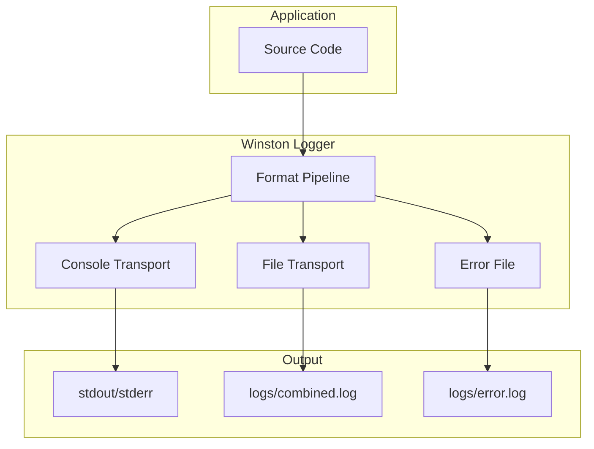

<!--
SPDX-License-Identifier: MIT
Copyright (c) 2025 UIP Team
-->

# Logger - Winston Logging System

Winston-based logging system with console and file transports, structured JSON output, and log rotation for production environments.

## Overview



## Features

| Feature | Description |
|---------|-------------|
| **Structured Logging** | JSON format with metadata |
| **Console Output** | Colorized human-readable output |
| **File Rotation** | Daily rotation, 14-day retention |
| **Error Isolation** | Separate error log file |
| **Request Logging** | HTTP request/response logging |
| **Performance** | Async I/O, buffered writes |

## Configuration

```typescript
// utils/logger.ts
import winston from 'winston';

const logger = winston.createLogger({
  level: process.env.LOG_LEVEL || 'info',
  format: winston.format.combine(
    winston.format.timestamp(),
    winston.format.errors({ stack: true }),
    winston.format.json()
  ),
  defaultMeta: { service: 'uip-traffic-backend' },
  transports: [
    // Console transport (development)
    new winston.transports.Console({
      format: winston.format.combine(
        winston.format.colorize(),
        winston.format.simple()
      )
    }),
    // Combined log file
    new winston.transports.File({
      filename: 'logs/combined.log',
      maxsize: 5242880,  // 5MB
      maxFiles: 14
    }),
    // Error log file
    new winston.transports.File({
      filename: 'logs/error.log',
      level: 'error'
    })
  ]
});

export { logger };
```

## Log Levels

| Level | Priority | Description | Usage |
|-------|----------|-------------|-------|
| `error` | 0 | Error conditions | Exceptions, failures |
| `warn` | 1 | Warning conditions | Deprecations, retries |
| `info` | 2 | Informational | Service status, events |
| `http` | 3 | HTTP requests | Request/response logs |
| `verbose` | 4 | Verbose info | Detailed operations |
| `debug` | 5 | Debug information | Development debugging |
| `silly` | 6 | All messages | Everything |

## Usage Examples

### Basic Logging

```typescript
import { logger } from '../utils/logger';

// Simple messages
logger.info('Server started on port 5000');
logger.warn('Cache miss for entity');
logger.error('Database connection failed');
logger.debug('Processing entity batch');

// With metadata
logger.info('Camera fetched', {
  cameraId: 'urn:ngsi-ld:Camera:001',
  responseTime: 125
});

// Error with stack trace
try {
  throw new Error('Connection refused');
} catch (error) {
  logger.error('Failed to connect', { error });
}
```

### Request Logging

```typescript
// Middleware for request logging
app.use((req, res, next) => {
  const start = Date.now();
  
  res.on('finish', () => {
    logger.http({
      method: req.method,
      url: req.originalUrl,
      status: res.statusCode,
      duration: Date.now() - start,
      userAgent: req.get('User-Agent')
    });
  });
  
  next();
});
```

### Agent Logging

```typescript
// In EcoTwinAgent
logger.info('EcoTwin processing request', {
  location: { lat: 10.77, lng: 106.70 },
  userProfile: profile.id
});

logger.debug('Gemini API response', {
  tokens: response.usageMetadata?.totalTokenCount
});
```

## Log Output Examples

### Console Output (Development)

```
info: Server started on port 5000
info: ✅ Connected to Stellio Context Broker
warn: ⚠️ Cache miss for Camera:001
error: ❌ Neo4j connection failed
```

### JSON Output (Production)

```json
{
  "level": "info",
  "message": "Camera fetched",
  "service": "uip-traffic-backend",
  "timestamp": "2025-01-15T10:30:00.000Z",
  "cameraId": "urn:ngsi-ld:Camera:001",
  "responseTime": 125
}
```

### Error Log

```json
{
  "level": "error",
  "message": "Database connection failed",
  "service": "uip-traffic-backend",
  "timestamp": "2025-01-15T10:30:00.000Z",
  "error": {
    "message": "Connection refused",
    "stack": "Error: Connection refused\n    at PostgresService..."
  }
}
```

## Environment Configuration

```bash
# .env
LOG_LEVEL=debug      # Logging level
LOG_FORMAT=json      # Output format (json/simple)
LOG_DIR=./logs       # Log directory
```

## Log File Rotation

```typescript
// Daily rotation with Winston DailyRotateFile
import DailyRotateFile from 'winston-daily-rotate-file';

const rotateTransport = new DailyRotateFile({
  filename: 'logs/application-%DATE%.log',
  datePattern: 'YYYY-MM-DD',
  maxSize: '20m',     // Rotate at 20MB
  maxFiles: '14d',    // Keep 14 days
  zippedArchive: true
});
```

## Related Documentation

- [Backend Overview](../overview.md) - Server architecture
- [Error Handler](../middlewares/errorHandler.md) - Error handling

## References

- [Winston Documentation](https://github.com/winstonjs/winston)
- [Node.js Logging Best Practices](https://blog.logrocket.com/node-js-logging-best-practices/)
