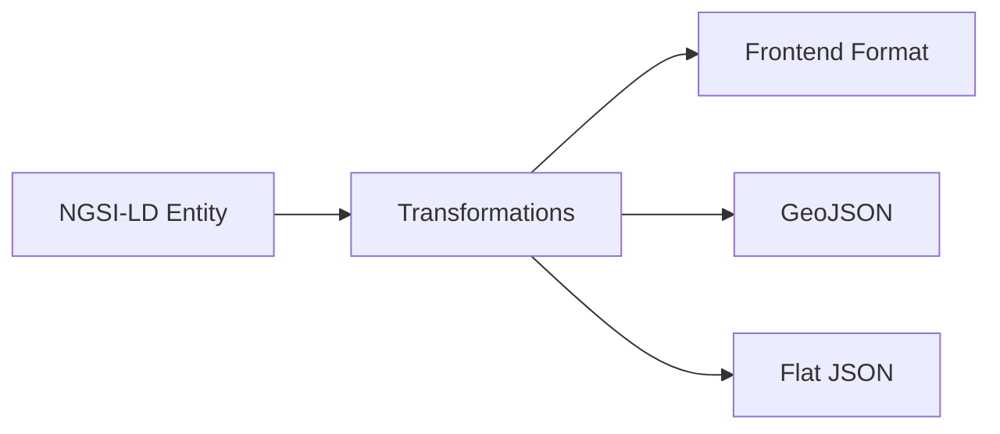

<!--
SPDX-License-Identifier: MIT
Copyright (c) 2025 UIP Team
-->

# Transformations - Data Transformation Utilities

Data transformation utilities for converting between **NGSI-LD**, **GeoJSON**, and frontend-friendly formats.

## Overview



## NGSI-LD to Frontend

### Camera Transformation

```typescript
export function transformCamera(ngsiEntity: any): Camera {
  return {
    id: ngsiEntity.id,
    name: extractValue(ngsiEntity, 'name') || 'Unknown Camera',
    location: transformLocation(ngsiEntity.location),
    imageUrl: extractValue(ngsiEntity, 'cameraImage') || 
              extractValue(ngsiEntity, 'image'),
    status: extractValue(ngsiEntity, 'status') || 'unknown',
    dateModified: ngsiEntity.dateModified || new Date().toISOString()
  };
}

function extractValue(entity: any, propertyName: string): any {
  const prop = entity[propertyName];
  if (!prop) return undefined;
  
  // NGSI-LD Property format
  if (prop.type === 'Property') {
    return prop.value;
  }
  
  // Simplified format
  if (prop.value !== undefined) {
    return prop.value;
  }
  
  return prop;
}
```

### Location Transformation

```typescript
export function transformLocation(location: any): {
  latitude: number;
  longitude: number;
} | null {
  if (!location) return null;
  
  // GeoProperty format
  if (location.type === 'GeoProperty' && location.value) {
    const coords = location.value.coordinates;
    return {
      latitude: coords[1],
      longitude: coords[0]
    };
  }
  
  // GeoJSON Point
  if (location.type === 'Point') {
    return {
      latitude: location.coordinates[1],
      longitude: location.coordinates[0]
    };
  }
  
  // Already transformed
  if (location.latitude !== undefined && location.longitude !== undefined) {
    return {
      latitude: location.latitude,
      longitude: location.longitude
    };
  }
  
  return null;
}
```

### Weather Transformation

```typescript
export function transformWeather(ngsiEntity: any): Weather {
  return {
    id: ngsiEntity.id,
    location: transformLocation(ngsiEntity.location),
    temperature: extractValue(ngsiEntity, 'temperature'),
    humidity: extractValue(ngsiEntity, 'relativeHumidity'),
    precipitation: extractValue(ngsiEntity, 'precipitation'),
    windSpeed: extractValue(ngsiEntity, 'windSpeed'),
    windDirection: extractValue(ngsiEntity, 'windDirection'),
    weatherType: extractValue(ngsiEntity, 'weatherType'),
    observedAt: extractValue(ngsiEntity, 'dateObserved') || 
                ngsiEntity.dateModified
  };
}
```

### Air Quality Transformation

```typescript
export function transformAirQuality(ngsiEntity: any): AirQuality {
  const aqi = extractValue(ngsiEntity, 'airQualityIndex') ||
              extractValue(ngsiEntity, 'aqi');
  
  return {
    id: ngsiEntity.id,
    location: transformLocation(ngsiEntity.location),
    aqi: aqi,
    category: getAqiCategory(aqi),
    pm25: extractValue(ngsiEntity, 'PM25') || 
          extractValue(ngsiEntity, 'pm2_5'),
    pm10: extractValue(ngsiEntity, 'PM10'),
    o3: extractValue(ngsiEntity, 'O3'),
    no2: extractValue(ngsiEntity, 'NO2'),
    co: extractValue(ngsiEntity, 'CO'),
    so2: extractValue(ngsiEntity, 'SO2'),
    observedAt: extractValue(ngsiEntity, 'dateObserved')
  };
}

function getAqiCategory(aqi: number): string {
  if (aqi <= 50) return 'Good';
  if (aqi <= 100) return 'Moderate';
  if (aqi <= 150) return 'Unhealthy for Sensitive Groups';
  if (aqi <= 200) return 'Unhealthy';
  if (aqi <= 300) return 'Very Unhealthy';
  return 'Hazardous';
}
```

## To GeoJSON

```typescript
export function toGeoJSON(entities: any[]): GeoJSON.FeatureCollection {
  return {
    type: 'FeatureCollection',
    features: entities.map(entity => ({
      type: 'Feature',
      id: entity.id,
      geometry: {
        type: 'Point',
        coordinates: [
          entity.location.longitude,
          entity.location.latitude
        ]
      },
      properties: {
        name: entity.name,
        status: entity.status,
        ...entity
      }
    }))
  };
}
```

## Batch Transformation

```typescript
export function transformBatch<T>(
  entities: any[],
  transformer: (entity: any) => T
): T[] {
  return entities
    .map(entity => {
      try {
        return transformer(entity);
      } catch (error) {
        logger.warn(`Transform failed for ${entity.id}:`, error);
        return null;
      }
    })
    .filter((item): item is T => item !== null);
}

// Usage
const cameras = transformBatch(ngsiEntities, transformCamera);
```

## Related Documentation

- [GenericNgsiService](../services/genericNgsiService.md) - Config-driven transforms
- [StellioService](../services/stellioService.md) - NGSI-LD source
- [Routes](../routes/overview.md) - Uses transformations

## References

- [NGSI-LD Specification](https://www.etsi.org/deliver/etsi_gs/CIM/001_099/009/01.06.01_60/gs_cim009v010601p.pdf)
- [GeoJSON Specification](https://datatracker.ietf.org/doc/html/rfc7946)
