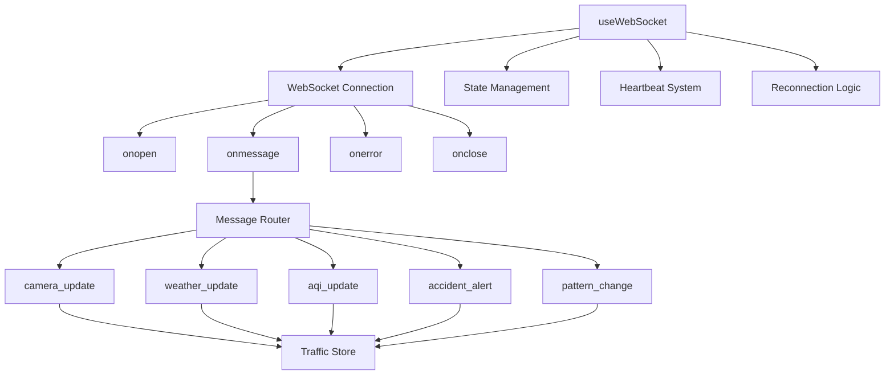

<!--
============================================================================
UIP - Urban Intelligence Platform
Copyright (c) 2025 UIP Team. All rights reserved.
https://github.com/UIP-Urban-Intelligence-Platform/UIP-Urban_Intelligence_Platform

SPDX-License-Identifier: MIT
============================================================================
File: frontend/hooks/useWebSocket.md
Module: Frontend Hooks - useWebSocket
Author: Nguyen Nhat Quang (Lead), Nguyen Viet Hoang, Nguyen Dinh Anh Tuan
Created: 2025-11-20
Version: 1.0.0
License: MIT

Description:
  useWebSocket hook documentation - React hook for WebSocket connection
  management with automatic reconnection and heartbeat.
============================================================================
-->

# useWebSocket Hook

React hook for WebSocket connection management with automatic reconnection, heartbeat, and message handling.

## Overview

The `useWebSocket` hook provides comprehensive WebSocket connection management:

- Automatic connection establishment
- Configurable reconnection with exponential backoff
- Heartbeat ping/pong for connection health
- Message type routing to store actions
- Toast notifications for critical events
- Connection status tracking



## Hook Signature

```typescript
interface WebSocketConfig {
  url: string;
  reconnectInterval?: number;     // Default: 3000ms
  maxReconnectAttempts?: number;  // Default: Infinity
  heartbeatInterval?: number;     // Default: 10000ms
}

interface WebSocketState {
  connected: boolean;
  connecting: boolean;
  error: Error | null;
  reconnectCount: number;
  lastMessage: WebSocketMessage | null;
}

const useWebSocket = (config: WebSocketConfig): WebSocketState;
```

## Usage

```tsx
import { useWebSocket } from '../hooks/useWebSocket';

function TrafficMonitor() {
    const { connected, connecting, error, reconnectCount, lastMessage } = useWebSocket({
        url: 'ws://localhost:5000',
        reconnectInterval: 5000,
        maxReconnectAttempts: 10,
        heartbeatInterval: 10000
    });

    return (
        <div>
            <ConnectionStatus connected={connected} reconnectCount={reconnectCount} />
            {error && <ErrorMessage error={error} />}
        </div>
    );
}
```

## Features

### Automatic Reconnection

- Exponential backoff starting from `reconnectInterval`
- Maximum delay capped at 30 seconds
- Configurable max attempts (default: infinite)

```typescript
const getReconnectDelay = useCallback(() => {
    const baseDelay = reconnectInterval;
    const maxDelay = 30000;
    return Math.min(baseDelay * Math.pow(2, reconnectAttemptsRef.current), maxDelay);
}, [reconnectInterval]);
```

### Heartbeat System

- Periodic ping messages to detect stale connections
- Configurable interval (default: 10 seconds)
- Automatic restart on reconnection

### Message Routing

Handles different message types and updates Zustand store:

| Message Type | Store Action | Description |
|--------------|--------------|-------------|
| `initial` | Multiple setters | Initial data snapshot |
| `camera_update` | `setCameras` | Camera status changes |
| `weather_update` | `setWeather` | Weather observations |
| `aqi_update` | `setAirQuality` | Air quality readings |
| `new_accident` | `addAccident` | New accident detected |
| `pattern_change` | `setPatterns` | Traffic pattern updates |

### Notifications

Critical events trigger toast notifications:

- Accident alerts (high priority)
- AQI warnings (moderate priority)
- Connection status changes

## State Values

| Property | Type | Description |
|----------|------|-------------|
| `connected` | `boolean` | True when connection is open |
| `connecting` | `boolean` | True during connection attempt |
| `error` | `Error \| null` | Last connection error |
| `reconnectCount` | `number` | Number of reconnection attempts |
| `lastMessage` | `WebSocketMessage \| null` | Most recent message received |

## Dependencies

- `react@^18.2`: useEffect, useRef, useState, useCallback
- `useTrafficStore`: Zustand store for state updates
- `useNotification`: Toast notification context
- `WebSocketMessage` type from `../types`

## Best Practices

1. **Single Instance**: Use one WebSocket connection per app
2. **Cleanup**: Hook handles cleanup on unmount
3. **Error Handling**: Always display connection status to users
4. **Reconnection**: Configure based on network conditions

## See Also

- [WebSocket Service](../services/websocket.md)
- [Traffic Store](../store/trafficStore.md)
- [ConnectionStatus Component](../components/ConnectionStatus.md)
