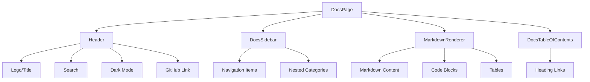

<!--
============================================================================
UIP - Urban Intelligence Platform
Copyright (c) 2025 UIP Team. All rights reserved.
https://github.com/UIP-Urban-Intelligence-Platform/UIP-Urban_Intelligence_Platform

SPDX-License-Identifier: MIT
============================================================================
File: frontend/pages/DocsPage.md
Module: Frontend Pages - DocsPage
Author: Nguyen Nhat Quang (Lead), Nguyen Viet Hoang, Nguyen Dinh Anh Tuan
Created: 2025-11-20
Version: 1.0.0
License: MIT

Description:
  DocsPage component documentation - interactive documentation page
  with Docusaurus-style navigation and markdown rendering.
============================================================================
-->

# DocsPage Component

Interactive documentation page with Docusaurus-style navigation, markdown rendering, table of contents, and dark mode support.

## Overview

The DocsPage component provides a complete documentation reading experience:

- Sidebar navigation with nested categories
- Markdown content rendering with syntax highlighting
- Table of contents (TOC) for current page
- Breadcrumb navigation
- Previous/Next navigation
- Search functionality
- Dark mode toggle



## Props & State

```typescript
interface DocsPageState {
    sidebarOpen: boolean;
    docContent: DocContent | null;
    loading: boolean;
    error: string | null;
    searchQuery: string;
    searchResults: Array<{ title: string; path: string }>;
    showSearch: boolean;
    darkMode: boolean;
}

interface DocContent {
    title: string;
    content: string;
    frontmatter?: Record<string, unknown>;
}
```

## Features

### Navigation

- **Sidebar**: Collapsible sidebar with nested navigation items
- **Breadcrumbs**: Path-based breadcrumb trail
- **Prev/Next**: Sequential document navigation
- **Mobile**: Responsive overlay sidebar on mobile

### Search

- Real-time search with debounce
- Search results dropdown with keyboard navigation
- Result highlighting

### Content Rendering

- Full Markdown support via `MarkdownRenderer`
- Syntax highlighting for code blocks
- Table rendering
- Image optimization

### Theming

- Light/Dark mode toggle
- Persistent preference in localStorage
- System preference detection

## Usage

```tsx
// In App.tsx router
import DocsPage from './pages/DocsPage';

<Route path="/docs/*" element={<DocsPage />} />
```

## Key Hooks

```typescript
// Path-based content loading
useEffect(() => {
    const loadContent = async () => {
        const content = await loadDocContent(location.pathname);
        setDocContent(content);
        document.title = `${content.title} | HCMC Traffic Docs`;
    };
    loadContent();
}, [location.pathname]);

// Navigation helpers
const { prev, next } = useMemo(() => getPrevNextDocs(currentPath), [currentPath]);
const breadcrumbs = useMemo(() => getBreadcrumbs(currentPath), [currentPath]);
```

## Dependencies

- `react-router-dom`: Routing and navigation
- `framer-motion`: Animations
- `lucide-react`: Icons (Menu, ChevronLeft, Moon, Sun, Search, etc.)
- `docsService`: Content loading and navigation structure
- `DocsSidebar`, `MarkdownRenderer`, `DocsTableOfContents`: Child components

## Accessibility

- Keyboard navigation support
- Focus management on route change
- ARIA labels for interactive elements
- Screen reader announcements

## See Also

- [Docs Service](../services/docsService.md)
- [Overview](../overview.md)
