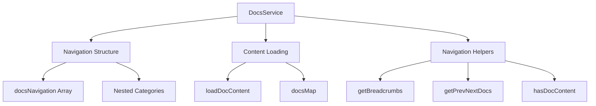

<!--
============================================================================
UIP - Urban Intelligence Platform
Copyright (c) 2025 UIP Team. All rights reserved.
https://github.com/UIP-Urban-Intelligence-Platform/UIP-Urban_Intelligence_Platform

SPDX-License-Identifier: MIT
============================================================================
File: frontend/services/docsService.md
Module: Frontend Services - Docs Service
Author: Nguyen Nhat Quang (Lead), Nguyen Viet Hoang, Nguyen Dinh Anh Tuan
Created: 2025-11-20
Version: 1.0.0
License: MIT

Description:
  Docs Service documentation - service for loading and managing
  documentation content from markdown files.
============================================================================
-->

# Docs Service

Service for loading and managing documentation content from markdown files with navigation structure.

## Overview

The docsService provides:

- Documentation navigation tree structure
- Content loading from markdown files
- Breadcrumb generation
- Previous/Next navigation helpers
- Search indexing support



## Types

```typescript
interface DocItem {
    id: string;
    title: string;
    path: string;
    children?: DocItem[];
    order?: number;
}

interface DocContent {
    title: string;
    content: string;
    frontmatter?: Record<string, unknown>;
}
```

## Navigation Structure

The `docsNavigation` array defines the complete documentation hierarchy:

```typescript
export const docsNavigation: DocItem[] = [
    {
        id: 'intro',
        title: 'Giới thiệu',
        path: '/docs',
        order: 1,
    },
    {
        id: 'quick-start',
        title: 'Bắt đầu nhanh',
        path: '/docs/quick-start',
        order: 2,
    },
    {
        id: 'agents',
        title: 'Hệ thống Agent',
        path: '/docs/agents',
        order: 5,
        children: [
            { id: 'agents-overview', title: 'Tổng quan Agent', path: '/docs/agents/overview' },
            {
                id: 'agents-analytics', 
                title: 'Analytics Agents', 
                path: '/docs/agents/analytics',
                children: [
                    { id: 'accident-detection', title: 'Accident Detection', path: '/docs/agents/analytics/accident-detection' },
                    // ... more nested items
                ]
            },
        ],
    },
    // ... more sections
];
```

## API Functions

### loadDocContent

Load markdown content for a given path.

```typescript
async function loadDocContent(path: string): Promise<DocContent | null>
```

### getBreadcrumbs

Generate breadcrumb trail for current path.

```typescript
function getBreadcrumbs(currentPath: string): Array<{ title: string; path: string }>
```

### getPrevNextDocs

Get previous and next documents for sequential navigation.

```typescript
function getPrevNextDocs(currentPath: string): {
    prev: DocItem | null;
    next: DocItem | null;
}
```

### hasDocContent

Check if a path has actual content in docsMap.

```typescript
function hasDocContent(path: string): boolean
```

## Usage

```typescript
import { 
    loadDocContent, 
    getBreadcrumbs, 
    getPrevNextDocs, 
    docsNavigation 
} from '../services/docsService';

// Load content for current page
const content = await loadDocContent('/docs/agents/overview');
if (content) {
    console.log(content.title);   // "Tổng quan Agent"
    console.log(content.content); // Markdown content
}

// Get breadcrumbs
const breadcrumbs = getBreadcrumbs('/docs/agents/analytics/accident-detection');
// [{ title: 'Docs', path: '/docs' }, { title: 'Agents', path: '/docs/agents' }, ...]

// Get prev/next navigation
const { prev, next } = getPrevNextDocs('/docs/agents/overview');
// prev: quick-start, next: agents-reference
```

## Navigation Categories

| Category | Description | Items |
|----------|-------------|-------|
| Giới thiệu | Introduction to the platform | 1 |
| Bắt đầu nhanh | Quick start guide | 1 |
| Cài đặt | Installation instructions | 1 |
| Kiến trúc | System architecture | 1 |
| Hệ thống Agent | Agent documentation | 14+ |
| Frontend | Component documentation | 3+ |
| API | API reference | 3 |
| Data Models | Standards & ontologies | 1 |
| DevOps | DevOps guide | 1 |
| Testing | Testing guide | 1 |
| Hướng dẫn | Development guides | 3 |
| Tutorial | Tutorial basics | 6 |

## Content Storage

Documentation content is stored in `docsMap` keyed by path:

```typescript
const docsMap: Record<string, DocContent> = {
    '/docs': { title: 'Introduction', content: '...' },
    '/docs/quick-start': { title: 'Quick Start', content: '...' },
    // ... more content
};
```

## Dependencies

- TypeScript interfaces for type safety
- Path-based content lookup
- Tree traversal for navigation

## See Also

- [DocsPage Component](../pages/DocsPage.md)
- [Overview](../overview.md)
