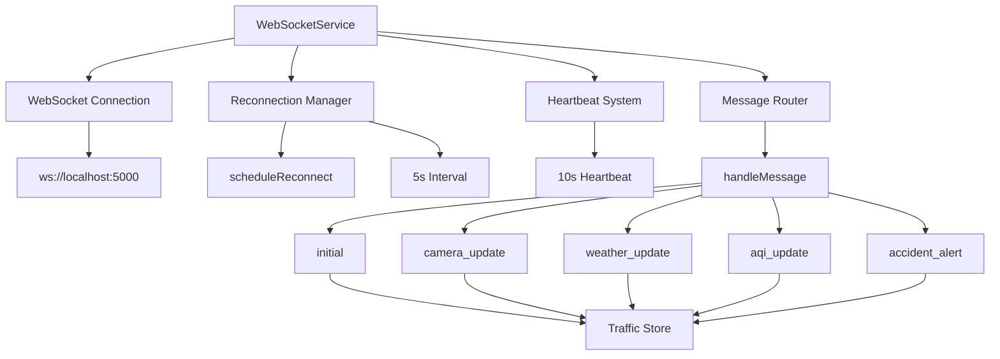
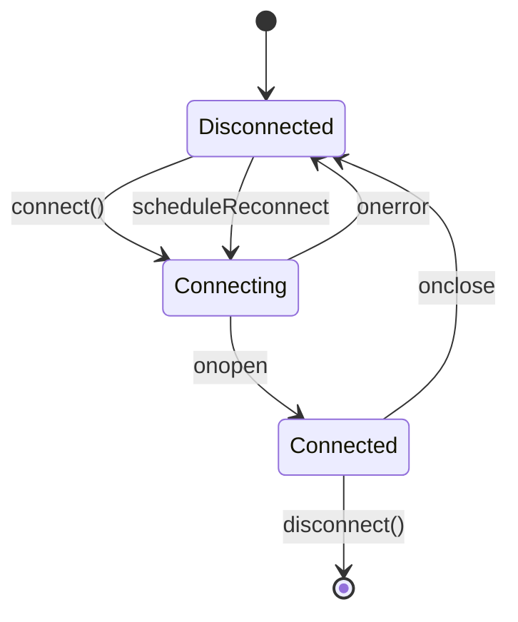

<!--
============================================================================
UIP - Urban Intelligence Platform
Copyright (c) 2025 UIP Team. All rights reserved.
https://github.com/UIP-Urban-Intelligence-Platform/UIP-Urban_Intelligence_Platform

SPDX-License-Identifier: MIT
============================================================================
File: frontend/services/websocket.md
Module: Frontend Services - WebSocket Service
Author: Nguyen Nhat Quang (Lead), Nguyen Viet Hoang, Nguyen Dinh Anh Tuan
Created: 2025-11-20
Version: 1.0.0
License: MIT

Description:
  WebSocket Service documentation - manages real-time bidirectional
  communication with automatic reconnection and heartbeat.
============================================================================
-->

# WebSocket Service

Service class managing real-time bidirectional communication with the backend, including automatic reconnection, heartbeat, and message routing.

## Overview

The WebSocketService provides:

- Automatic reconnection with exponential backoff
- Heartbeat mechanism for connection health
- Topic-based message routing
- Connection state management
- Manual connect/disconnect controls
- Message handler registration
- Integration with Zustand store



## Class API

### Constructor

```typescript
class WebSocketService {
    private ws: WebSocket | null = null;
    private reconnectInterval: number = 5000;
    private url: string;

    constructor() {
        this.url = import.meta.env.VITE_WS_URL || 'ws://localhost:5000';
    }
}
```

### connect()

Establish WebSocket connection.

```typescript
connect(): void
```

Features:

- Prevents duplicate connections
- Sets up event handlers (onopen, onmessage, onerror, onclose)
- Starts heartbeat on successful connection
- Updates store connection status

### disconnect()

Gracefully close WebSocket connection.

```typescript
disconnect(): void
```

Features:

- Marks as intentional close (prevents reconnection)
- Clears reconnect timers
- Stops heartbeat
- Closes WebSocket

### registerHandler()

Register a custom message handler for a specific type.

```typescript
registerHandler(type: string, handler: (data: any) => void): void
```

## Message Types

| Type | Description | Store Action |
|------|-------------|--------------|
| `initial` | Initial data snapshot | Multiple setters |
| `camera_update` | Camera status changes | `addCamera()` |
| `weather_update` | Weather observations | `addWeather()` |
| `aqi_update` | Air quality readings | `addAirQuality()` |
| `new_accident` | New accident detected | `addAccident()` |
| `pattern_change` | Traffic pattern updates | `addPattern()` |
| `accident_alert` | High-priority accident | Notification |
| `aqi_warning` | High AQI warning | Notification |

## Connection Lifecycle



## Usage

```typescript
import { wsService } from './services/websocket';

// In Dashboard component
useEffect(() => {
    wsService.connect();
    return () => wsService.disconnect();
}, []);

// Register custom handler
wsService.registerHandler('custom_event', (data) => {
    console.log('Custom event received:', data);
});
```

## Singleton Instance

The service exports a singleton instance:

```typescript
export const wsService = new WebSocketService();
```

## Message Handling

```typescript
private handleMessage(message: WebSocketMessage): void {
    const store = useTrafficStore.getState();

    switch (message.type) {
        case 'initial':
            if (message.data?.cameras) {
                message.data.cameras.forEach(store.addCamera);
            }
            // ... other data types
            break;

        case 'camera_update':
            if (Array.isArray(message.data)) {
                message.data.forEach(store.addCamera);
            }
            break;

        // ... more cases
    }
}
```

## Configuration

| Setting | Default | Description |
|---------|---------|-------------|
| `url` | `ws://localhost:5000` | WebSocket server URL |
| `reconnectInterval` | `5000` | Reconnection delay (ms) |
| `heartbeatInterval` | `10000` | Heartbeat ping interval (ms) |

## Dependencies

- Native WebSocket API
- `useTrafficStore`: Zustand store for state updates
- `WebSocketMessage` type from `../types`

## Error Handling

- Connection errors trigger automatic reconnection
- Message parse errors are logged but don't crash
- Graceful handling of server disconnections

## See Also

- [useWebSocket Hook](../hooks/useWebSocket.md)
- [Traffic Store](../store/trafficStore.md)
- [ConnectionStatus Component](../components/ConnectionStatus.md)
