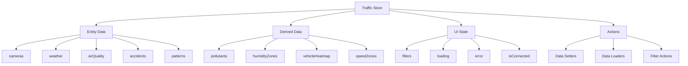

<!--
============================================================================
UIP - Urban Intelligence Platform
Copyright (c) 2025 UIP Team. All rights reserved.
https://github.com/UIP-Urban-Intelligence-Platform/UIP-Urban_Intelligence_Platform

SPDX-License-Identifier: MIT
============================================================================
File: frontend/store/trafficStore.md
Module: Frontend Store - Traffic Store
Author: Nguyen Nhat Quang (Lead), Nguyen Viet Hoang, Nguyen Dinh Anh Tuan
Created: 2025-11-20
Version: 1.0.0
License: MIT

Description:
  Traffic Store documentation - centralized Zustand state management
  for the traffic application with persistence.
============================================================================
-->

# Traffic Store

Centralized state management for the traffic application using Zustand with persistence.

## Overview

The Traffic Store manages all application state:

- Entity data (cameras, weather, air quality, accidents, patterns)
- Derived data (pollutants, heatmaps, zones)
- UI state (layer visibility, filters)
- Loading and error states
- Persistence to localStorage



## State Categories

### Entity Data

```typescript
interface TrafficStore {
    cameras: Camera[];
    weather: Weather[];
    airQuality: AirQuality[];
    accidents: Accident[];
    patterns: TrafficPattern[];
    selectedCamera: Camera | null;
    selectedAccident: Accident | null;
    selectedPattern: TrafficPattern | null;
}
```

### Derived Data

```typescript
interface TrafficStore {
    pollutants: PollutantData[];
    humidityZones: HumidityZonesCollection | null;
    vehicleHeatmap: VehicleHeatmapData | null;
    speedZones: SpeedZonesCollection | null;
    districts: District[];
    selectedDistrict: string | null;
    accidentFrequency: AccidentFrequencyData | null;
}
```

### UI State

```typescript
interface TrafficStore {
    isConnected: boolean;
    loading: boolean;
    error: string | null;
    filters: FilterState;
    lastUpdate: Date | null;
}
```

## Filter State

```typescript
interface FilterState {
    // Layer visibility
    showCameras: boolean;
    showWeather: boolean;
    showAirQuality: boolean;
    showAccidents: boolean;
    showPatterns: boolean;
    showAQIHeatmap: boolean;
    showWeatherOverlay: boolean;
    showAccidentMarkers: boolean;
    showPatternZones: boolean;
    showPollutantCircles: boolean;
    showHumidityLayer: boolean;
    showVehicleHeatmap: boolean;
    showSpeedZones: boolean;
    showCorrelationLines: boolean;
    showAccidentFrequency: boolean;
    showRoutePlanner: boolean;
    
    // AI Agents
    showHealthAdvisor: boolean;
    showInvestigator: boolean;
    showPredictive: boolean;
    
    // Citizen Reports
    showCitizenReports: boolean;
    showCitizenForm: boolean;
    
    // Filters
    districts: string[];
    severityFilter: ('minor' | 'moderate' | 'severe' | 'fatal')[];
    aqiLevelFilter: string[];
    dateRange: {
        start: Date | null;
        end: Date | null;
    };
}
```

## Actions

### Data Management

```typescript
// Set entire arrays
setCameras: (cameras: Camera[]) => void;
setWeather: (weather: Weather[]) => void;
setAirQuality: (airQuality: AirQuality[]) => void;
setAccidents: (accidents: Accident[]) => void;
setPatterns: (patterns: TrafficPattern[]) => void;

// Add individual items (for WebSocket updates)
addCamera: (camera: Camera) => void;
addWeather: (weather: Weather) => void;
addAirQuality: (airQuality: AirQuality) => void;
addAccident: (accident: Accident) => void;
addPattern: (pattern: TrafficPattern) => void;
```

### Data Loading

```typescript
// Load all data from API
loadAllData: () => Promise<void>;

// Refresh data (clears cache first)
refreshData: () => Promise<void>;

// Load specific data types
loadPollutants: (pollutantTypes?: string[]) => Promise<void>;
loadHumidityZones: () => Promise<void>;
loadVehicleHeatmap: (timeRange?: string) => Promise<void>;
loadSpeedZones: (currentTime?: boolean) => Promise<void>;
loadDistricts: () => Promise<void>;
loadAccidentFrequency: (days?: number) => Promise<void>;
```

### Filter Actions

```typescript
toggleFilter: (filterName: keyof FilterState) => void;
updateFilters: (filters: Partial<FilterState>) => void;
resetFilters: () => void;
```

### Computed Values

```typescript
getFilteredCameras: () => Camera[];
getFilteredAccidents: () => Accident[];
getFilteredAirQuality: () => AirQuality[];
getActivePatterns: () => TrafficPattern[];
getAccidentsByDistrict: () => Record<string, Accident[]>;
getAverageAQI: () => number;
```

## Usage

```typescript
import { useTrafficStore } from './store/trafficStore';

function CameraList() {
    // Subscribe to specific state
    const cameras = useTrafficStore(state => state.cameras);
    const loading = useTrafficStore(state => state.loading);
    
    // Get actions
    const { refreshData, toggleFilter } = useTrafficStore();
    
    // Get filtered data
    const filteredCameras = useTrafficStore(state => state.getFilteredCameras());
    
    return (
        <div>
            {loading && <Spinner />}
            {cameras.map(camera => <CameraCard key={camera.id} camera={camera} />)}
            <button onClick={refreshData}>Refresh</button>
        </div>
    );
}
```

## Persistence

Store is persisted to localStorage:

```typescript
export const useTrafficStore = create<TrafficStore>()(
    persist(
        (set, get) => ({
            // ... state and actions
        }),
        {
            name: 'traffic-store',
            storage: createJSONStorage(() => localStorage),
            partialize: (state) => ({
                filters: state.filters,
                // Only persist non-volatile state
            }),
        }
    )
);
```

## Dependencies

- `zustand@^4.4`: State management
- `zustand/middleware`: Persistence middleware
- `../services/api`: API service for data loading
- `../types`: TypeScript interfaces

## Best Practices

1. **Selectors**: Use selectors to subscribe to minimal state
2. **Actions**: Use store actions rather than direct mutations
3. **Computed**: Use getter methods for derived data
4. **Persistence**: Only persist user preferences, not entity data

## See Also

- [API Service](../services/api.md)
- [WebSocket Service](../services/websocket.md)
- [Types Index](../types/index.md)
