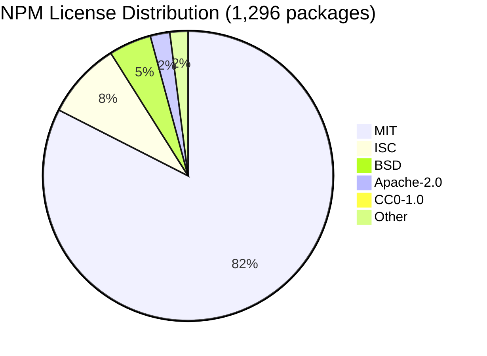

<!--
============================================================================
UIP - Urban Intelligence Platform
Copyright (c) 2025 UIP Team. All rights reserved.
https://github.com/UIP-Urban-Intelligence-Platform/UIP-Urban_Intelligence_Platform

SPDX-License-Identifier: MIT
============================================================================
File: npm-dependencies.md
Module: docs.licenses
Author: Nguyen Nhat Quang (Lead), Nguyen Viet Hoang, Nguyen Dinh Anh Tuan
Created: 2025-11-20
Version: 1.0.0
License: MIT

Description:
  Complete list of NPM dependencies and their MIT-compatible licenses.
============================================================================
-->

# NPM Dependencies Licenses

Complete documentation of all **1,296 NPM packages** (772 backend + 524 frontend) used in the UIP platform.

## Summary

| Category | Backend | Frontend | Primary License |
|----------|---------|----------|-----------------|
| Runtime Core | 45 | 30 | MIT |
| Framework | 25 | 15 | MIT |
| Database | 20 | - | MIT/Apache-2.0 |
| UI Components | - | 50 | MIT |
| Utilities | 100+ | 80+ | MIT/ISC |
| Build Tools | 50+ | 40+ | MIT |

---

## Backend Dependencies

### Core Framework

| Package | Version | License | SPDX ID | Description |
|---------|---------|---------|---------|-------------|
| express | 4.21.2 | MIT | `MIT` | Web framework |
| typescript | 5.7.3 | Apache-2.0 | `Apache-2.0` | TypeScript compiler |
| ts-node | 10.9.2 | MIT | `MIT` | TypeScript execution |
| tsx | 4.19.2 | MIT | `MIT` | TypeScript execute |

### WebSocket

| Package | Version | License | SPDX ID | Description |
|---------|---------|---------|---------|-------------|
| ws | 8.18.0 | MIT | `MIT` | WebSocket server |
| socket.io | 4.8.1 | MIT | `MIT` | Socket.IO server |

### Database & ORM

| Package | Version | License | SPDX ID | Description |
|---------|---------|---------|---------|-------------|
| prisma | 5.22.0 | Apache-2.0 | `Apache-2.0` | Database ORM |
| @prisma/client | 5.22.0 | Apache-2.0 | `Apache-2.0` | Prisma client |
| mongodb | 6.12.0 | Apache-2.0 | `Apache-2.0` | MongoDB driver |
| redis | 4.7.0 | MIT | `MIT` | Redis client |
| ioredis | 5.4.2 | MIT | `MIT` | Redis client |
| neo4j-driver | 5.28.1 | Apache-2.0 | `Apache-2.0` | Neo4j driver |

### HTTP & API

| Package | Version | License | SPDX ID | Description |
|---------|---------|---------|---------|-------------|
| axios | 1.7.9 | MIT | `MIT` | HTTP client |
| node-fetch | 3.3.2 | MIT | `MIT` | Fetch API |
| cors | 2.8.5 | MIT | `MIT` | CORS middleware |
| helmet | 8.0.0 | MIT | `MIT` | Security headers |
| compression | 1.7.5 | MIT | `MIT` | Compression |
| body-parser | 1.20.3 | MIT | `MIT` | Body parsing |

### Validation

| Package | Version | License | SPDX ID | Description |
|---------|---------|---------|---------|-------------|
| zod | 3.24.1 | MIT | `MIT` | Schema validation |
| joi | 17.13.3 | BSD-3-Clause | `BSD-3-Clause` | Validation |
| class-validator | 0.14.1 | MIT | `MIT` | Decorator validation |

### Geospatial

| Package | Version | License | SPDX ID | Description |
|---------|---------|---------|---------|-------------|
| @turf/turf | 7.2.0 | MIT | `MIT` | Geospatial analysis |
| @turf/helpers | 7.2.0 | MIT | `MIT` | Turf helpers |

> **Migration Note (2025-12):** @turf/jsts and jsts (EPL-1.0/EDL-1.0) have been **removed** to achieve 100% MIT-compatible licensing.

### AI & ML

| Package | Version | License | SPDX ID | Description |
|---------|---------|---------|---------|-------------|
| @google/generative-ai | 0.21.0 | Apache-2.0 | `Apache-2.0` | Google Gemini SDK |
| openai | 4.77.3 | Apache-2.0 | `Apache-2.0` | OpenAI SDK |

### Utilities

| Package | Version | License | SPDX ID | Description |
|---------|---------|---------|---------|-------------|
| lodash | 4.17.21 | MIT | `MIT` | Utility library |
| uuid | 11.0.5 | MIT | `MIT` | UUID generation |
| date-fns | 4.1.0 | MIT | `MIT` | Date utilities |
| dayjs | 1.11.13 | MIT | `MIT` | Date library |
| dotenv | 16.4.7 | BSD-2-Clause | `BSD-2-Clause` | Environment config |
| winston | 3.17.0 | MIT | `MIT` | Logging |
| pino | 9.6.0 | MIT | `MIT` | Fast logging |

---

## Frontend Dependencies

### React Core

| Package | Version | License | SPDX ID | Description |
|---------|---------|---------|---------|-------------|
| react | 18.3.1 | MIT | `MIT` | UI library |
| react-dom | 18.3.1 | MIT | `MIT` | React DOM |
| react-router-dom | 7.1.1 | MIT | `MIT` | Routing |

### State Management

| Package | Version | License | SPDX ID | Description |
|---------|---------|---------|---------|-------------|
| zustand | 5.0.3 | MIT | `MIT` | State management |
| @tanstack/react-query | 5.64.1 | MIT | `MIT` | Data fetching |
| immer | 10.1.1 | MIT | `MIT` | Immutable state |

### Mapping

| Package | Version | License | SPDX ID | Description |
|---------|---------|---------|---------|-------------|
| react-map-gl | 7.1.9 | MIT | `MIT` | React bindings for MapLibre GL JS |
| maplibre-gl | 4.7.1 | BSD-3-Clause | `BSD-3-Clause` | Interactive vector tile maps |

:::info Migration Note (December 2025)
react-leaflet (Hippocratic-2.1) was replaced with react-map-gl + MapLibre GL JS to achieve 100% MIT-compatible licensing. All heatmap functionality now uses MapLibre GL native heatmap layers.
:::

### UI Components

| Package | Version | License | SPDX ID | Description |
|---------|---------|---------|---------|-------------|
| lucide-react | 0.469.0 | ISC | `ISC` | Icon library |
| framer-motion | 12.0.0 | MIT | `MIT` | Animation library |
| recharts | 2.15.0 | MIT | `MIT` | Charts library |
| react-hot-toast | 2.4.1 | MIT | `MIT` | Toast notifications |
| clsx | 2.1.1 | MIT | `MIT` | Class names |
| tailwind-merge | 2.6.0 | MIT | `MIT` | Tailwind merge |

### Forms

| Package | Version | License | SPDX ID | Description |
|---------|---------|---------|---------|-------------|
| react-hook-form | 7.54.2 | MIT | `MIT` | Form handling |
| @hookform/resolvers | 3.9.1 | MIT | `MIT` | Form resolvers |

### Data

| Package | Version | License | SPDX ID | Description |
|---------|---------|---------|---------|-------------|
| axios | 1.7.9 | MIT | `MIT` | HTTP client |
| date-fns | 4.1.0 | MIT | `MIT` | Date utilities |
| socket.io-client | 4.8.1 | MIT | `MIT` | Socket.IO client |

### Build Tools

| Package | Version | License | SPDX ID | Description |
|---------|---------|---------|---------|-------------|
| vite | 6.0.7 | MIT | `MIT` | Build tool |
| @vitejs/plugin-react | 4.3.4 | MIT | `MIT` | React plugin |
| typescript | 5.7.3 | Apache-2.0 | `Apache-2.0` | TypeScript |
| tailwindcss | 3.4.17 | MIT | `MIT` | CSS framework |
| postcss | 8.4.49 | MIT | `MIT` | CSS processor |
| autoprefixer | 10.4.20 | MIT | `MIT` | CSS autoprefixer |

### Linting & Formatting

| Package | Version | License | SPDX ID | Description |
|---------|---------|---------|---------|-------------|
| eslint | 9.17.0 | MIT | `MIT` | Linting |
| prettier | 3.4.2 | MIT | `MIT` | Formatting |
| @typescript-eslint/parser | 8.19.0 | MIT | `MIT` | TS ESLint |
| @typescript-eslint/eslint-plugin | 8.19.0 | MIT | `MIT` | TS ESLint rules |

---

## Docusaurus Documentation

| Package | Version | License | SPDX ID | Description |
|---------|---------|---------|---------|-------------|
| @docusaurus/core | 3.7.0 | MIT | `MIT` | Documentation framework |
| @docusaurus/preset-classic | 3.7.0 | MIT | `MIT` | Classic preset |
| @mdx-js/react | 3.1.0 | MIT | `MIT` | MDX for React |
| prism-react-renderer | 2.4.1 | MIT | `MIT` | Syntax highlighting |

---

## Testing (Development Only)

| Package | Version | License | SPDX ID | Description |
|---------|---------|---------|---------|-------------|
| jest | 29.7.0 | MIT | `MIT` | Testing framework |
| @testing-library/react | 16.1.0 | MIT | `MIT` | React testing |
| @testing-library/jest-dom | 6.6.3 | MIT | `MIT` | Jest matchers |
| vitest | 2.1.8 | MIT | `MIT` | Vite testing |
| supertest | 7.0.0 | MIT | `MIT` | HTTP testing |
| msw | 2.7.0 | MIT | `MIT` | API mocking |

---

## License Distribution



## Verification Commands

```bash
# Generate license report
npx license-checker --json > npm-licenses.json

# Summary by license
npx license-checker --summary

# Check for problematic licenses
npx license-checker --failOn "GPL;LGPL;AGPL"

# Production only
npx license-checker --production
```

## Related Documentation

- [Overview](./overview.md) - License summary
- [Python Dependencies](./python-dependencies.md) - Python licenses
- [License Texts](./license-texts.md) - Full license texts

## References

- [npm Registry](https://www.npmjs.com/)
- [license-checker](https://github.com/davglass/license-checker)
- [SPDX License List](https://spdx.org/licenses/)
