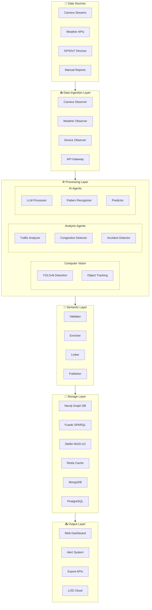
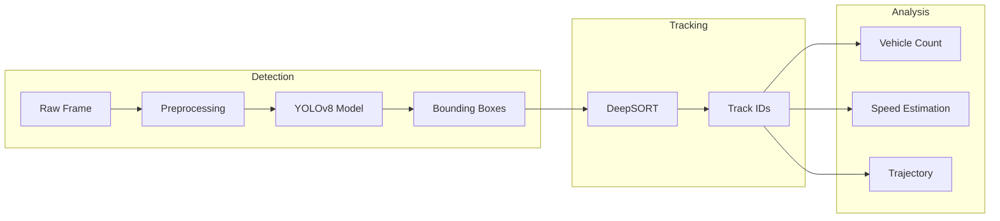
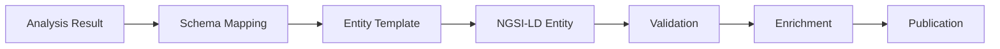
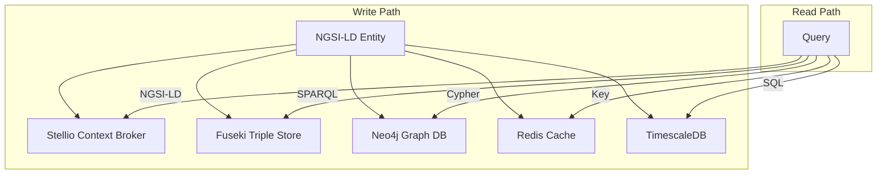
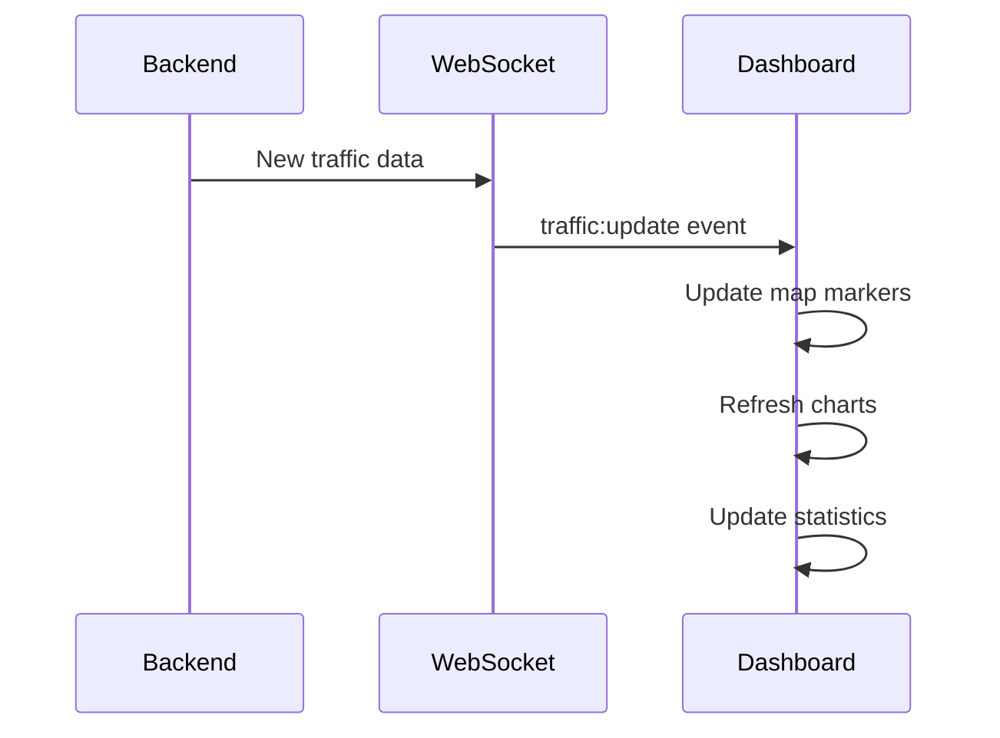

<!--
============================================================================
UIP - Urban Intelligence Platform
Copyright (c) 2025 UIP Team. All rights reserved.
https://github.com/UIP-Urban-Intelligence-Platform/UIP-Urban_Intelligence_Platform

SPDX-License-Identifier: MIT
============================================================================
File: wiki/Data-Flow.md
Module: Data Flow Documentation
Author: Nguyen Nhat Quang (Lead), Nguyen Viet Hoang, Nguyen Dinh Anh Tuan
Created: 2025-11-20
Version: 2.0.0
License: MIT

Description:
  Complete data flow through the Multi-Agent LOD Pipeline.
============================================================================
-->
# 🔀 Data Flow

Complete data flow through the Multi-Agent LOD Pipeline.

---

## 📊 Overview



---

## 1️⃣ Data Ingestion Layer

### Input Sources

| Source | Agent | Format | Frequency |
|--------|-------|--------|-----------|
| Traffic Cameras | `CameraObserverAgent` | RTSP/HTTP | Real-time |
| Weather APIs | `WeatherObserverAgent` | REST JSON | 5 min |
| IoT Sensors | `DeviceObserverAgent` | MQTT/CoAP | 1 sec |
| Manual Reports | API Gateway | REST JSON | On-demand |

### Camera Observer Flow

```python
# agents/camera_observer_agent.py
class CameraObserverAgent:
    async def observe(self, camera_id: str):
        # 1. Fetch frame from camera stream
        frame = await self.fetch_frame(camera_id)
        
        # 2. Preprocess image
        processed = self.preprocess(frame)
        
        # 3. Add metadata
        observation = {
            "camera_id": camera_id,
            "timestamp": datetime.utcnow().isoformat(),
            "frame": processed,
            "location": self.get_camera_location(camera_id)
        }
        
        # 4. Send to processing queue
        await self.publish_to_queue("raw_observations", observation)
```

### Data Format at Ingestion

```json
{
  "source_type": "camera",
  "source_id": "CAM-001",
  "timestamp": "2025-11-29T10:30:00Z",
  "location": {
    "type": "Point",
    "coordinates": [106.6297, 10.8231]
  },
  "raw_data": {
    "image": "base64_encoded_frame",
    "resolution": [1920, 1080],
    "fps": 30
  },
  "metadata": {
    "camera_type": "PTZ",
    "angle": 45,
    "zoom": 1.0
  }
}
```

---

## 2️⃣ Processing Layer

### Computer Vision Pipeline



### YOLOv8 Detection

```python
# agents/cv_detection_agent.py
class CVDetectionAgent:
    def __init__(self):
        self.model = YOLO('yolov8x.pt')
        self.tracker = DeepSORT()
        
    async def process(self, frame_data: dict):
        # 1. Decode frame
        frame = self.decode_frame(frame_data['raw_data']['image'])
        
        # 2. Run detection
        results = self.model(frame, classes=[2, 3, 5, 7])  # cars, motorcycles, buses, trucks
        
        # 3. Track objects
        tracks = self.tracker.update(results)
        
        # 4. Analyze traffic
        analysis = self.analyze_traffic(tracks)
        
        return {
            "detections": results.to_json(),
            "tracks": tracks,
            "analysis": analysis
        }
```

### Traffic Analysis

```python
# agents/traffic_analyzer_agent.py
class TrafficAnalyzerAgent:
    def analyze(self, tracks: list, camera_config: dict):
        # Count vehicles per lane
        lane_counts = self.count_by_lane(tracks, camera_config['lanes'])
        
        # Calculate density
        density = self.calculate_density(
            vehicle_count=len(tracks),
            road_area=camera_config['road_area']
        )
        
        # Estimate average speed
        avg_speed = self.estimate_speed(tracks)
        
        # Determine congestion level
        congestion = self.classify_congestion(density, avg_speed)
        
        return {
            "lane_counts": lane_counts,
            "total_vehicles": len(tracks),
            "density": density,
            "average_speed": avg_speed,
            "congestion_level": congestion
        }
```

### Congestion Classification

| Level | Density | Speed | Description |
|-------|---------|-------|-------------|
| `Free` | < 20 veh/km | > 60 km/h | Normal flow |
| `Light` | 20-40 veh/km | 40-60 km/h | Slightly busy |
| `Moderate` | 40-60 veh/km | 20-40 km/h | Heavy traffic |
| `Heavy` | 60-80 veh/km | 10-20 km/h | Congested |
| `Severe` | > 80 veh/km | < 10 km/h | Gridlock |

---

## 3️⃣ Semantic Layer

### NGSI-LD Entity Generation



### Entity Mapping

```python
# agents/ngsi_ld_entity_generator_agent.py
class NGSILDEntityGeneratorAgent:
    def generate_entity(self, analysis: dict, camera: dict):
        entity = {
            "@context": [
                "https://uri.etsi.org/ngsi-ld/v1/ngsi-ld-core-context.jsonld",
                "https://smart-data-models.github.io/dataModel.Transportation/context.jsonld"
            ],
            "id": f"urn:ngsi-ld:TrafficFlowObserved:{camera['id']}:{timestamp}",
            "type": "TrafficFlowObserved",
            "dateObserved": {
                "type": "Property",
                "value": datetime.utcnow().isoformat()
            },
            "location": {
                "type": "GeoProperty",
                "value": {
                    "type": "Point",
                    "coordinates": [camera['lng'], camera['lat']]
                }
            },
            "intensity": {
                "type": "Property",
                "value": analysis['total_vehicles']
            },
            "occupancy": {
                "type": "Property",
                "value": analysis['density'] / 100
            },
            "averageVehicleSpeed": {
                "type": "Property",
                "value": analysis['average_speed'],
                "unitCode": "KMH"
            },
            "congestionLevel": {
                "type": "Property",
                "value": analysis['congestion_level']
            },
            "refDevice": {
                "type": "Relationship",
                "object": f"urn:ngsi-ld:Device:{camera['id']}"
            }
        }
        return entity
```

### SOSA/SSN Observation

```python
# agents/sosa_observation_agent.py
class SOSAObservationAgent:
    def create_observation(self, analysis: dict, sensor: dict):
        return {
            "@context": [
                "http://www.w3.org/ns/sosa/",
                "http://www.w3.org/ns/ssn/"
            ],
            "@type": "sosa:Observation",
            "@id": f"urn:observation:{uuid.uuid4()}",
            "sosa:resultTime": datetime.utcnow().isoformat(),
            "sosa:hasFeatureOfInterest": {
                "@id": f"urn:road-segment:{sensor['road_id']}"
            },
            "sosa:observedProperty": {
                "@id": "traffic:vehicleCount"
            },
            "sosa:hasSimpleResult": analysis['total_vehicles'],
            "sosa:madeBySensor": {
                "@id": f"urn:sensor:{sensor['id']}"
            },
            "ssn:implements": {
                "@id": "traffic:vehicleCounting"
            }
        }
```

### Validation

```python
# agents/data_validation_agent.py
class DataValidationAgent:
    def validate(self, entity: dict) -> ValidationResult:
        errors = []
        
        # Required fields
        required = ['id', 'type', '@context']
        for field in required:
            if field not in entity:
                errors.append(f"Missing required field: {field}")
        
        # Type validation
        if not entity['id'].startswith('urn:ngsi-ld:'):
            errors.append("ID must be URN format")
        
        # Property validation
        for key, value in entity.items():
            if isinstance(value, dict):
                if value.get('type') == 'Property':
                    if 'value' not in value:
                        errors.append(f"Property {key} missing value")
                elif value.get('type') == 'Relationship':
                    if 'object' not in value:
                        errors.append(f"Relationship {key} missing object")
        
        return ValidationResult(valid=len(errors) == 0, errors=errors)
```

---

## 4️⃣ Storage Layer

### Multi-Database Storage



### Storage Agent

```python
# agents/data_storage_agent.py
class DataStorageAgent:
    async def store(self, entity: dict):
        tasks = [
            self.store_stellio(entity),
            self.store_fuseki(entity),
            self.store_neo4j(entity),
            self.cache_redis(entity),
            self.store_timescale(entity)
        ]
        await asyncio.gather(*tasks)
    
    async def store_stellio(self, entity: dict):
        async with httpx.AsyncClient() as client:
            response = await client.post(
                f"{self.stellio_url}/ngsi-ld/v1/entities",
                json=entity,
                headers={"Content-Type": "application/ld+json"}
            )
            if response.status_code == 409:
                # Entity exists, update
                await client.patch(
                    f"{self.stellio_url}/ngsi-ld/v1/entities/{entity['id']}/attrs",
                    json=entity
                )
    
    async def store_fuseki(self, entity: dict):
        # Convert to RDF triples
        graph = self.entity_to_rdf(entity)
        
        # Store in Fuseki
        self.fuseki_client.update(
            f"INSERT DATA {{ {graph.serialize(format='nt')} }}"
        )
    
    async def store_neo4j(self, entity: dict):
        async with self.neo4j_driver.session() as session:
            await session.execute_write(
                lambda tx: tx.run(
                    """
                    MERGE (e:Entity {id: $id})
                    SET e.type = $type,
                        e.data = $data,
                        e.updatedAt = datetime()
                    """,
                    id=entity['id'],
                    type=entity['type'],
                    data=json.dumps(entity)
                )
            )
```

---

## 5️⃣ Output Layer

### Real-time Dashboard



### Alert System

```python
# agents/alert_dispatcher_agent.py
class AlertDispatcherAgent:
    async def check_and_alert(self, analysis: dict):
        alerts = []
        
        # Congestion alert
        if analysis['congestion_level'] in ['Heavy', 'Severe']:
            alerts.append({
                "type": "CONGESTION",
                "severity": "HIGH",
                "location": analysis['location'],
                "message": f"Heavy congestion detected on {analysis['road_name']}"
            })
        
        # Accident alert
        if analysis.get('accident_detected'):
            alerts.append({
                "type": "ACCIDENT",
                "severity": "CRITICAL",
                "location": analysis['location'],
                "message": "Possible accident detected"
            })
        
        # Send alerts
        for alert in alerts:
            await self.send_alert(alert)
    
    async def send_alert(self, alert: dict):
        # WebSocket broadcast
        await self.ws_broadcast('alert:new', alert)
        
        # Store in database
        await self.store_alert(alert)
        
        # External notifications (SMS, Email, etc.)
        if alert['severity'] == 'CRITICAL':
            await self.notify_authorities(alert)
```

### LOD Cloud Export

```python
# agents/lod_export_agent.py
class LODExportAgent:
    def export_to_lod(self, entities: list):
        # Generate RDF dump
        graph = rdflib.Graph()
        
        for entity in entities:
            self.add_entity_to_graph(graph, entity)
        
        # Add provenance
        graph.add((
            URIRef(f"{BASE_URI}/dataset"),
            PROV.wasGeneratedBy,
            URIRef(f"{BASE_URI}/pipeline")
        ))
        
        # Serialize in multiple formats
        outputs = {
            'turtle': graph.serialize(format='turtle'),
            'ntriples': graph.serialize(format='nt'),
            'jsonld': graph.serialize(format='json-ld')
        }
        
        return outputs
```

---

## 📊 Data Quality Metrics

### Quality Checkpoints

| Stage | Metric | Target |
|-------|--------|--------|
| Ingestion | Completeness | > 99% |
| Detection | Accuracy | > 95% |
| Tracking | Consistency | > 90% |
| Semantic | Validity | 100% |
| Storage | Availability | 99.9% |

### Monitoring

```python
# agents/data_quality_agent.py
class DataQualityAgent:
    def assess_quality(self, data: dict) -> QualityReport:
        return QualityReport(
            completeness=self.check_completeness(data),
            accuracy=self.check_accuracy(data),
            timeliness=self.check_timeliness(data),
            consistency=self.check_consistency(data),
            validity=self.check_validity(data)
        )
```

---

## 🔗 Related Pages

- [[Multi-Agent-System]] - Agent documentation
- [[Semantic-Web-Guide]] - Semantic technologies
- [[Docker-Services]] - Infrastructure
